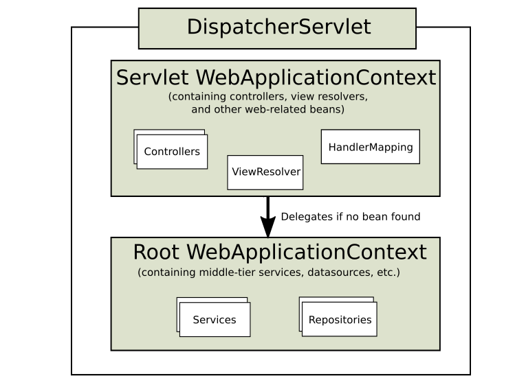
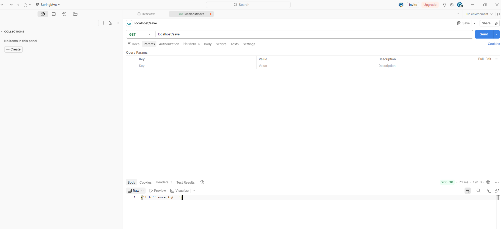
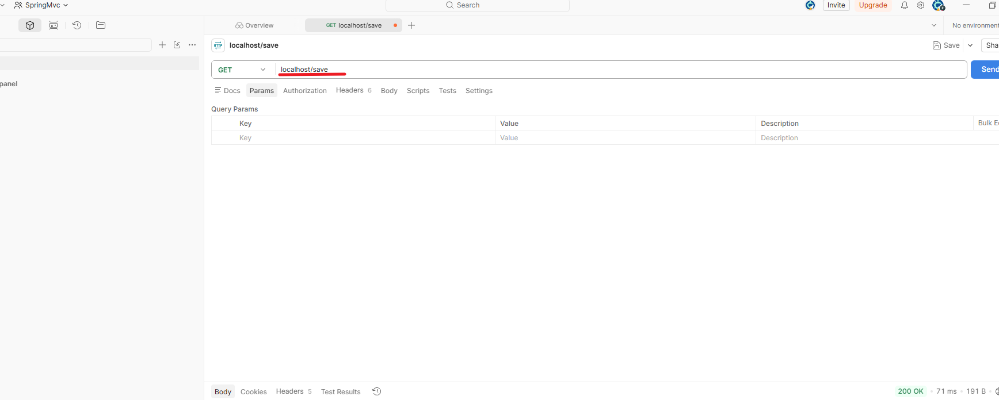
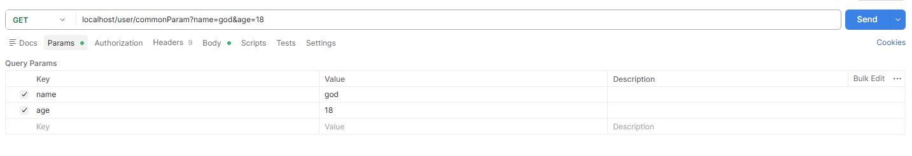
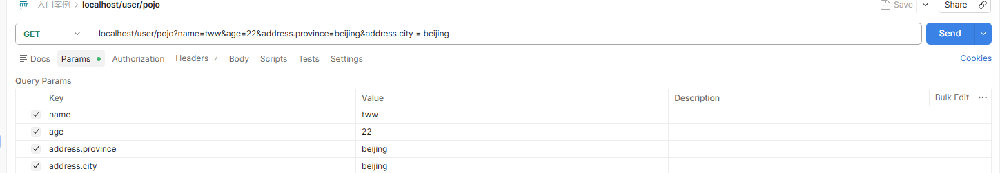
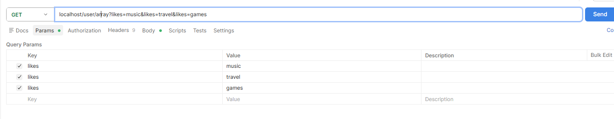
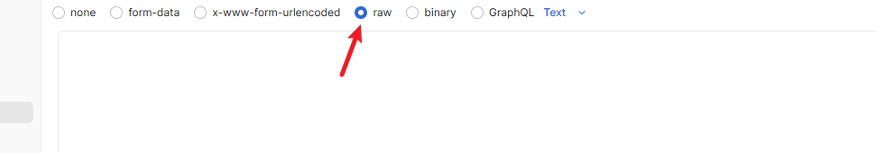
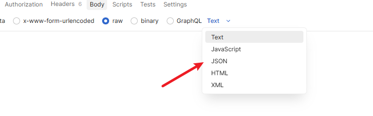

## 3.1 Spring MVC介绍

​	SpringMVC技术与`Servlet`技术功能等同，均属于web层开发技术。SpringMVC开发web更加简洁。是一种基于Java实现MVC模型的轻量级Web框架。


### 3.1.1 SpringMVC入门案例

​	1.创建SpringMVC控制器类（等同于`Servlet`功能）

```java
@Controller
public class UserController{
    @RequestMapping("/save")
    @ResponseBody
    public String save(){
        System.out.println("user save ...");
       	return "{'info':'springmvc'}";
    }
}
```

​	2.初始化SpringMVC环境（同Spring环境），设定SpringMVC加载对应的bean

```java	
@Configuration
@ComponentScan("com.itheima.controller")
public class SpringMvcConfig{
    
}
```

​	3.初始化`Servlet`容器，加载SpringMVC环境，并设置SpringMVC技术处理的请求

```java	
public class ServletContainersInitConfig extends AbstractAnnotationConfigDispatcherServletInitializer{
    protected WebApplicationContext createServletApplicationContext(){
        //注册Servlet WebApplicationContext
        AnnotationConfigWebApplicationContext ctx = new AnnotationConfigWebApplicationContext();
        ctx.register(SpringMvcConfig.class);
        
        return ctx;
    }
    
    protected String[] getServletMappings(){
        return new String[]{"/"};
    }
    
    protected WebApplicationContext createRootApplicationContext(){
        return null
    }
}
```

​	所需的依赖坐标：

```xml
  <dependencies>
    <!-- Spring MVC 6.x (Jakarta EE 9+，兼容 Tomcat 10.x) -->
    <dependency>
      <groupId>org.springframework</groupId>
      <artifactId>spring-webmvc</artifactId>
      <version>6.1.14</version>
    </dependency>
    <!-- Jakarta Servlet API (Tomcat 10 已内置，设为 provided) -->
    <dependency>
      <groupId>jakarta.servlet</groupId>
      <artifactId>jakarta.servlet-api</artifactId>
      <version>6.0.0</version>
      <scope>provided</scope>
    </dependency>
  </dependencies>
```


### 3.1.2 bean加载控制

​	通常，SpringMvcConfig类会专门管理`Controller`Bean。Spring则会管理`dao、service`层的bean。**如何避免Spring错误的加载到SpringMVC的bean**： 加载Spring控制的bean的时候，排除调SpringMVC控制的bean。

​	方式一：Spring加载的bean设定扫描范围为`com.itheima`，排除掉`controller`包内的bean

```java
@Configuration
@ComponentScan( value = "com.tww",
        excludeFilters = @ComponentScan.Filter(
                type = FilterType.ANNOTATION, //表示以注解的类型过滤
                classes = Controller.class // 过滤的注解类型
        ))
public class SpringConfig {
}

```

​	`excludeFilters:`排除扫描路径中加载的bean，需要指定类别(type)与具体项（`classes`)

​	`includeFilters:`加载指定的bean，需要指定类别（type）与具体项（classes)

方式二：Spring加载的bean设定扫描范围为精准范围，例如，`service`包、`dao`包等

```java
@Configuration
@ComponentScan({"com.tww.dao","com.tww.service"})
public class SpringConfig {
}
```

​	Spring提供了更简洁为`Servlet`容器配置SpringMVC的办法，如下：

```java


public class ServletContainersInitConfig extends AbstractAnnotationConfigDispatcherServletInitializer{
	
    //配置Spring容器
    @Override
    protected Class<?>[] getRootConfigClasses() {
        return new Class[]{SpringConfig.class};
    }
	
    //配置SpringMVC容器
    @Override
    protected Class<?>[] getServletConfigClasses() {
        return new Class[]{SpringMvcConfig.class};
    }

    //哪些请求让SpringMVC处理，/代表所有请求
    @Override
    protected String[] getServletMappings() {
        return new String[]{"/"};
    }
}

```


### 3.1.3 上下文（Context）层次结构

​	根（root）`WebApplicationContext`通常包含基础设施Bean，例如需要再多个`Servelt`实例中共享的数据存储库和业务服务。这些Bean有效地被继承，并且可以在`Servlet`特定的子`WebApplicationContext`被重写。下面的图片显示了这种关系：



下面的例子配置了一个`WebApplicationContext`的层次结构

```java
public class MyWebAppInitializer extends AbstractAnnotationConfigDispatcherServletInitializer {

    @Override
    protected Class<?>[] getRootConfigClasses() {
        return new Class<?>[] { RootConfig.class };
    }

    @Override
    protected Class<?>[] getServletConfigClasses() {
        return new Class<?>[] { App1Config.class };
    }

    @Override
    protected String[] getServletMappings() {
        return new String[] { "/app1/*" };
    }
}


```

 


### 3.1.4 Postman

​	Postman是一款功能强大的网页调试与发送网页HTTP请求的Chrome插件。首先打开`workspace`



​	在GET处可以选择请求方式。在后面的输入框里输入请求路径



​	点击send，就会向后端发送请求

 


### 3.1.5 设置请求映射路径

​	有时候，不同的类有相同的方法，当我们为他们设置了相同的映射路径时，就会出问题。比如：

```java
    @RequestMapping("/save")
    @ResponseBody
    public String save(){
        System.out.println("book save ...");
        return "{'module':'book save'}";
    }
```

​	和

```java
    @RequestMapping("/save")
	@ResponseBody
    public String save(){
        System.out.println("user saver");
        return "{'info':'save_ing...'}" ;
    }
```

​	一个是BookController的`save`方法，一个是`UserController`的`save`方法。但映射路径都相同。为避免这种方法。我们**设置模块名作为请求路径前缀**。如：

```java
    @RequestMapping("/user/save")
	@ResponseBody
    public String save(){
        System.out.println("user saver");
        return "{'info':'save_ing...'}" ;
    }
```

​	和

```java
    @RequestMapping("/book/save")
    @ResponseBody
    public String save(){
        System.out.println("book save ...");
        return "{'module':'book save'}";
    }
```

​	有一种简略的写法，将模块映射写在类上，方法名映射写在方法上。像下面这样：

```java
@Controller
@RequestMapping("/book")
public class BookController {

    @RequestMapping("/save")
    @ResponseBody
    public String save(){
        System.out.println("book save ...");
        return "{'module':'book save'}";
    }

}
```

​	如果要访问save，则访问`localhost/book/save`即可。其他类同样可以使用这种办法管理

```java
package com.tww.controller;

import org.springframework.stereotype.Controller;
import org.springframework.web.bind.annotation.RequestMapping;
import org.springframework.web.bind.annotation.ResponseBody;

//定义Controller
@Controller
@RequestMapping("/user")
public class UserController {


    //设置当前操作的访问路径
    @RequestMapping("/save")
    //将返回值作为响应体发送给请求方
    @ResponseBody
    public String save(){
        System.out.println("user saver");
        return "{'info':'save_ing...'}" ;
    }


    @RequestMapping("/delete")
    @ResponseBody
    public String delete(){
        System.out.println("user delete ...");
        return "{'module':'user delete'}";
    }
}

```


### 3.1.6 前后端之间参数的传递

​	前端向后端传送数据主要通过get和post方法。post方法用于表单提交的参数。本节讲解前端参数和后端参数的沟通问题。也就是当后端的处理方法，是不同类型时，前端该如何传参。后端又该如何处理

​	总的来说，传参类型一共有五种：

1. **普通参数**

   普通参数非常简单。后端方法形参和前端参数名字对应即可。如果是多个参数，需要用`@RequestParam`注明。

   ```java
       @RequestMapping("/commonParam")
       @ResponseBody
       public String commonParam(@RequestParam("name") String name, @RequestParam("age") int  age){
           System.out.println("param==="+name);
           System.out.println("age==="+age);
           return "{'module':'user commonParam'}";
       }
   ```

​	前端请求如下：



​	


2. **POJO类型参数**

对于普通的pojo参数，也就是所有成员变量都是基础类型，只需要按照对应构造函数顺序请求即可。

```java
    @RequestMapping("/pojo")
    @ResponseBody
    public String pojoProject(User user){
        System.out.println(user);
        return "{'module':'user pojo'}";
    }
```

前端请求如下：



​	如果pojo里还嵌套了其他的类，那么只需用`类名.成员变量`赋值即可。


3. **数组类型参数**

​	后端处理方法：

```java
    @RequestMapping("/array")
    @ResponseBody
    public String arrayParam(@RequestParam("likes") String[] likes){
        System.out.println("arrayParam:"+ Arrays.toString(likes));
        return "{'module':'user array'}";
    }
```

​	前端请求中，key值用同一个即可。




1. **集合类型参数**

​	集合参数与之类似，但必须加上`@RequestParam`

```java
    @RequestMapping("/list")
    @ResponseBody
    public String listParam(@RequestParam("list") List<String>list){
        for (String s : list) {
            System.out.println(s+" ");
        }

        return "{'module':'user list'}";
    }
```

​	其实，为了指明前后端参数对应，都建议使用`@RequestParam`

​	


### 3.1.7 JSON数据传递

​	现代项目中，最常用的数据传递还是JSON。所以，我们先在后端导入JSON包

```xml
   <dependency>
      <groupId>com.fasterxml.jackson.core</groupId>
      <artifactId>jackson-databind</artifactId>
      <version>2.19.2</version>
    </dependency>
```

​	在Postman中，如果要向后端传送json数据，按照下面这个流程来


​	 





​	但是现在，Spring无法处理前端发送过来的JSON数据，所以要在SpringMvcConfig里做一些配置，如下：

```java
@Configuration
@ComponentScan("com.tww.controller")
@EnableWebMvc
public class SpringMvcConfig {
}
```

​	注解`@EnableWebMvc`就可以开启将JSON数据转换成对应对象的功能，它还有其他很多强大功能，


​	后端处理方法如下：

```java
    @RequestMapping("/listParamForJson")
    @ResponseBody
    public String listParamForJson(@RequestBody List<String> likes){
        System.out.println("list common(json) 参数传递 list ==>"+ likes);

        return "{'module':'list common for json param'}";
    }
```

​	由于传过来的是一个`Body`，所以需要用**注解`@RequestBody`表明”接收HTTP请求体（Body）”**。Spring在底层会自动将文本转换成Java对象。由于参数是List<String\>。所以转换器会把`JSON`数组映射为一个Java`ArrayList<String>`对象。

​	


### 3.1.8 日期类型参数传递

​	日期类型数据基于系统不同格式也不尽相同。如：

```tex
2088/08/08
2088-08-08
```

​	在格式对应的时候，如`Date`类对应格式：`2088/08/08`，能够想普通类一样接收后转换。但不对应时，就转换不了。可以通过注解`@DateTimeFormat()`注解，来指定该日期类的格式。这样，前端请求输入正确格式时就能成功。

```java
    @RequestMapping("/dataParam")
    @ResponseBody
    public String dataParam(@RequestParam("date")@DateTimeFormat(pattern ="yyyy-MM-dd") Date date){
        System.out.println("date:"+date);
        return"{'module':'Date param'}";
    }
```

​	这样的方法，能够正确处理前端传过来的`2088-08-08`这种日期，但却会拒绝其他日期格式。

​	常见的日期格式：

```tex
yyyy/MM/dd
yyyy/MM/dd HH:mm:ss
yyyy-MM-dd
```


### 3.1.9 响应

​	响应是指，接收请求后，返回给前端的数据。下面看一段代码：

```java
    @RequestMapping("/toPage")
    public String toPage(){
        System.out.println("return page");
        return "page";
    }
```

​	该方法处理对`/toPage`的请求，由视图解析器根据配置（如前缀`/WEB-INF/views/`和后缀`.jsp`）将其解析并转发到对应的jsp页面。视图解析器需要再SpringMvcConfig配置类中进行配置，如下：

```java
@Configuration
@ComponentScan("com.tww.controller")
@EnableWebMvc
public class  SpringMvcConfig {

    //视图解析器
    @Bean
    public ViewResolver jspViewResolver() {
        InternalResourceViewResolver resolver = new InternalResourceViewResolver();
        resolver.setPrefix("/WEB-INF/views/");
        resolver.setSuffix(".jsp");
        // 可选：设置优先级，数字越小优先级越高[reference:7]
        resolver.setOrder(1);
        return resolver;
    }
}
```

​	

​	如果想要返回纯文本信息，需要做一些额外的工作。将方法用`@ResponseBody`注解，该注解的作用是：

​	**指示该方法的返回值应直接绑定到 HTTP 响应的正文**

​	而响应头（`Content-Type`）默认是纯文本，`text/plain`，Spring默认使用`StringHttpMessageConverter`来处理字符串，它会在响应头加上`Content-Type:text/plain;charset=UFT-8`;这意味着前端拿到的就是一段纯文本。

```java
    @RequestMapping("/toText")
    @ResponseBody
    public String toText(){
        System.out.println("return text");
        return "response Text";
    }
```

​	`StringHttpMessageConverter`负责处理String类型，将字符串转换为HTTP响应体。而`MappingJackson2HttpMessageConverter`专门处理对象（如Map、List、POJO)。它会调用`Jackson`库将对象序列化为标准JSON字符串。并把内容类型标记为`apllication/json`

​	所以，响应JSON数据做要的事情只要两件：

1. 使用注解`@ResponseBody`，
2. `return`一个对象

```java
    @RequestMapping("/toJsonList")
    @ResponseBody
    public List toJsonList(){
        System.out.println("return json data");
        User user  = new User();
        User user1 = new User();
        user.setName("tww");
        user.setAge(18);

        user1.setName("zhangsan");
        user1.setAge(22);
        List<User> list = new ArrayList<>();
        list.add(user);
        list.add(user1);
        return list;
    }
```


## 3.2 REST 

​	**RESTful API 是一种以“资源”为中心、充分利用 HTTP 协议标准方法（GET/POST/PUT/DELETE）和状态码的架构风格，旨在构建清晰、可缓存、无状态、便于分布式部署的 Web 服务接口。**

​	什么意思呢，可以简单理解为一种HTTP接口的格式。

- 传统风格资源描述形式

```java
http://localhost/user/getById?id=1
http://localhost/user/saveUser
```

- REST风格形式描述

```java
http://localhost/user/1
http://localhost/user
```

​	REST风格可以隐藏资源的访问行为，无法通过地址得知对资源是何种操作，这保证了安全性。但需要注意的是，所有关于user的操作都在这个路径上进行。所以我们要进行区分。

​	常见的HTTP方法有`GET、POST、PUT、DELETE`。现在用图书来举例。我们用`REST`风格，将增删改查操作一一对应。

- **查看所有图书**

```java
GET demo.com/books
```

- **新增一本图书**

```java
POST demo.com/books
Data: name =shuxue
```

- **修改一本书**

```java
PUT demo.com/books
Data: id=1,name=shuxue
```

- 删除一本书

```java
DELETE demo.com/books
Data:id =1
```

​	而根据REST风格对资源进行访问的行为则称为`RESTful`


### 3.2.1 REST ful 

Spring提供了一系列注解，用于对应HTTP请求操作。通过不同的注解，可以将Controller方法映射到不同类型的HTTP请求。

- **`GET`** : `@GetMapping`，用于查询资源，对应 `HTTP GET` 请求。

  示例代码：
  ```java
  @GetMapping("/users") //GET 查询用集合 
  public List<User> getUsers(){
      return userList;
  }
  //对应请求路径：localhost/users

- **`POST`** : `@PostMapping`，用于创建资源，对应 `HTTP POST` 请求。

  示例代码：

  ```java
  @PostMapping("/users") // Post 新增用户
  public String save(@RequestBody User user){
      return "success";
  }
  //对应请求路径 localhost/users 
  ```

- **`PUT`** : `@PutMapping`，用于整体修改资源，对应 `HTTP PUT` 请求。

  示例代码：

  ```java
  @PutMapping("/users/{id}") //Put 修改id为{id}的用户
  public String update(
          @PathVariable Integer id,
          @RequestBody User user){
      return "success";
  }
  //对应请求路径：localhost/users/1
  ```

- **`DELETE`** : `@DeleteMapping`，用于删除资源，对应 `HTTP DELETE` 请求。

  示例代码：

  ```java
  @DeleteMapping("/users/{id}") //删除id为{id}的用户
  public String delete(@PathVariable Integer id){
      return "success";
  }
  //对应请求路径：localhost/users/1
  ```

- **`PATCH`** : `@PatchMapping`，用于部分修改资源，对应 `HTTP PATCH` 请求。

  示例代码：

  ```java
  @PatchMapping("/users/{id}") //修改id为{id}的部分数据
  public String updatePart(@PathVariable Integer id){
      return "success";
  }
  //
  ```

​	更常见的做法是将公共资源路径写在类上。如下
```java
@RestController
@RequestMapping("/users")
public class UserController {
    @GetMapping
    public List<User> getUsers(){
        return userList;
    }

    @GetMapping("/{id}")
    public User getById(@PathVariable Integer id){
        return user;
    }

    @PostMapping
    public String save(@RequestBody User user){
        return "success";
    }

    @PutMapping("/{id}")
    public String update(
            @PathVariable Integer id,
            @RequestBody User user){

        return "success";
    }


    @DeleteMapping("/{id}")
    public String delete(@PathVariable Integer id){
        return "success";
    }

    @PatchMapping("/{id}")
    public String updatePart(
            @PathVariable Integer id,
            @RequestBody Map<String,Object> data){

        return "success";
    }

}
```

​	**`@RestController`注解是SpringMVC提供的一个组合注解，用于标识一个专门处理HTTP请求并返回响应数据的`Controller`类**。也就是说，它等价于

```java
@RestController
 	  == 
@Controller
ResponseBody
```

​	在这个类中写的方法都会把返回值写入HTTP的响应体中。

​	**`@PathVariable`**注解用于获取URL路径中的参数，并绑定到方法的参数上。需要配合`{}`使用。例如：

```java
    @DeleteMapping("/{id}")
    public String delete(@PathVariable Integer id){
        return "success";
    }
```

​	如果请求

```java
DELETE localhost/user/100
```

​	则会将100绑定到delete方法的形参id上。

​	
