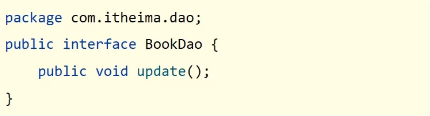
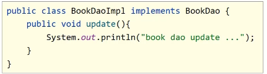

# 4.1 AOP简介

​	AOP(Aspect Oriented Programming)面向切面编程，一种编程范式，指导开发者如何组织程序结构。

​	**在不惊动原始设计的基础上为起进行功能增强**

​	AOP是一种编程思想，并不是Spring独有，就像。面向对象编程一样

> 面向对象编程：将事物抽象为一个对象，该对象负责自己的属性和行为。通过对象间的协作来完成编程任务。


​	下面介绍AOP相关术语

1. 连接点（Join point) : 程序执行过程中的一个点，例如一个方法的执行或一个异常的处理。在SpringAOP中，一个连接点总是代表一个方法的执行
2. 切面（Aspect）：一个跨越多个类的关注点的模块化
3. 通知（Advice）：一个切面在一个特定的连接点采取的行动。
4. 切入点（Pointcut）：匹配连接点的式子


### 4.1.1 入门案例

​	第一步，**先导入AOP的坐标**

```xml
        <dependency>
            <groupId>org.aspectj</groupId>
            <artifactId>aspectjweaver</artifactId>
            <version>1.9.4</version>
        </dependency>
```

 	第二步：创建通知类

```java
public class MyAdvice{
    ...
}
```

​	第三步，在通知类中编写通知方法：

```java
    public void method(){
        System.out.println(System.currentTimeMillis());
    }
```

​	第四步，编写切入点，通过方法+注解的形式，切入点定义了那些连接点要切入通知

```java
    //定义切入点
    @Pointcut("execution(void com.tww.dao.BookDao.update())")
    private void pt(){}
```

​	第五步，告诉通知，在连接点的什么时候执行，如before在连接点之前执行

```java
    //共性功能，通知
    @Before("pt()")
    public void method(){
        System.out.println(System.currentTimeMillis());
    }
```

​	第六步，把该通知类交给Spring管理，用`@Component`告诉Spring这是一个组件，用`@Aspect`告诉Spring这是一个切片类

```java
@Component
@Aspect
public class MyAdvice {
    //定义切入点
    @Pointcut("execution(void com.tww.dao.BookDao.update())")
    private void pt(){}

    //共性功能，通知
    @Before("pt()")
    public void method(){
        System.out.println(System.currentTimeMillis());
    }
}
```

​	第七步，要在配置类中，用注解`EnableAspectJAutoProxy`告诉Spring我们使用注解开发的AOP类

```java
@Configuration
@ComponentScan("com.tww")
@EnableAspectJAutoProxy
public class SpringConfig {
}
```

​	最后，就能在不惊动原代码的情况下为`update()`方法新增一个功能，该功能是输出系统时间。


### 4.1.2 AOP工作流程

1. Spring容器启动
2. 读取所有切面配置中的切入点

```java
@Component
@Aspect
public class MyAdvice {
    
    @Pointcut("execution(void com.tww.dao.BookDao.save())")
    public void ptx(){}
    
    //定义切入点
    @Pointcut("execution(void com.tww.dao.BookDao.update())")
    private void pt(){}
    
    
    
    //共性功能，通知
    @Before("pt()")
    public void method(){
        System.out.println(System.currentTimeMillis());
    }
}
```

​	只读取在`Before()`或者说使用了的切入点，ptx不读取

3. 初始化Bean，判定bean对应的类中的方法是否匹配到任意切入点
   - 匹配失败，创建对象
   - 匹配成功，创建原始对象（目标对象）的代理对象
4. 获取Bean执行方法
   - 获取Bean，调用方法并执行，完成操作
   - 获得的bean是代理对象时，根据代理对象的运行模式运行原始方法与增强的内容，完成操作


### 4.1.3 切入点表达式

​	切入点：要进行增强的方法。

​	切入点表达式：要进行增强的方法的描述方式



​	描述方式一：执行com.itheima.dao包下的BookDao接口中的无参数`update`方法

```java
execution(void com.itheima.dao.BookDao.update())
```

​	描述方式二：执行`com.itheima.dao.impl`包下的`BookDaoImpl`类中的无参数`update`方法

```java
execution(void com.itheima.dao.impl.BookDaoImpl.update())
```


​	切入点表达式标准格式：动作关键字（访问修饰符 返回值 包名.类/接口名.方法名（参数） 异常名）

```java	
execution (public User com.itheima.service.UserService.findById(int))
```

- 动作关键字：描述切入点的行为动作，例如`execution`表示执行到指定切入点
- 访问修饰符：publi，private等。可以省略
- 返回值
- 包名
- 类/接口名
- 方法名
- 参数
- 异常名：方法中定义抛出指定异常，可以省略


​	可以使用通配符描述切入点，快速描述

- **\*** :单个独立的任意符号，可以独立出现，也可以作为前缀或后缀的匹配符出现

  ```java	
  execution(public * com.itheima.*.UserService.find*(*))
  ```

  匹配`com.itheima`包下的任意包中的`UserService`类或接口中所有以find开头的带有一个参数且任意返回值的方法

- **..** : 多个连续的任意符号，可以独立出现，常用语简化包名与参数的书写

  ```java	
  execution (public User com..UserService.findById(..))
  ```

  ​	匹配com包下的任意包中的UserService类或接口中所有名称为findById的方法，参数任意个，类型任意

- +： 专门用于匹配子类类型

```java	
excution(* *..*Service+.*(..))
```


​	**书写技巧**

- 所有代码按照标准规范开发，否则一下技巧全部失效
- 描述切入点通常描述切口，而不描述实现类
- 访问控制修饰符针接口均采用`public`描述（可省略）
- 返回值类型对于增删改使用精准类型加速匹配，对于查询类使用\*统配快速描述
- 包名书写尽量不使用..匹配，效率过低，常用\*做单个包描述匹配，或精准匹配
- 接口名/类名书写与模块相关采用\*匹配，例如`getById`书写写成`getBy*`，`selectAll`书写成`selectAll`
- 参数规则较为复杂，根据业务方法灵活调整
- 通常不使用异常作为匹配规则


# 4.2 AOP通知类型

​	AOP通知描述抽取了共性功能，根据共性功能抽取的位置不同，最终运行代码时要将其加入到合理的位置。

​	**AOP**通知共分为5种类型

- 前置通知
- 后置通知
- 环绕通知（重点）
- 返回后通知（了解）
- 抛出异常后通知（了解）


### 4.2.1 Before （前置通知）

​	使用@Before注解方法，使该方法在原始操作调用之前调用。例如：

```java	
    @Before("pt()")
    public void before(){
        System.out.println("before advice....");
    }
```

​	

​	


### 4.2.2 After (后置通知)

​	使用@After注解方法，使该方法在原始操作调用之后调用：

```java	
    @After("pt()")
    public void after(){ System.out.println("after advice ...");}
```


### 4.2.3 Around(环绕通知)

​	环绕通知在原始操作前和原始操作后调用，需要用一个方法来表示原始操作的调用。在方法参数中写入`ProceedingJoinPoint`，然后调用方法`proceed()`表示元素操作。

```java	
    @Around("pt()")
    public void around(ProceedingJoinPoint pjp) throws Throwable {
        System.out.println("around before advice ...");
        //表示对原始操作的调用
        pjp.proceed();
        System.out.println("around before advice ...");
    }

```

​	注意，如果切入点对应的方法有返回值。那么环绕通知需要返回对象。通常为`Object`

```java	
    @Around("pt2()")
    public Object around(ProceedingJoinPoint pjp) throws Throwable {
        System.out.println("around before advice ...");
        //表示对原始操作的调用
        Object obj = pjp.proceed();
        System.out.println("around before advice ...");
        
        return obj;
    }

```

​	然后调用原始操作的地方，会走到这里，返回这个obj

​	注意事项：

1. 环绕通知必须依赖形参`ProceedingJoinPoin`才能实现对原始方法的调用，进而实现原始方法调用前后同时添加通知
2. 通知中如果未使用`ProceedingJoinPoint`对原始方法进行调用将跳过原始方法的执行
3. 对原始方法的调用可以不接受返回值。通知方法设置为void即可。如果接受防护值，必须设定`Object`类型
4. 原始方法的返回值如果是void类型，通知方法的返回类型可以设置为void，也可以设置为Object
5. 由于无法预知原始方法运行后是否会抛出异常，因此环绕通知方法必须抛出Throwable对象

​	

​	我们可以通过ProceedingJoinPoint参数来获取对原始方法的一些信息。

```java
        Signature signature = ptj.getSignature();
        signature.getName(); //获取方法名
        signature.getDeclaringTypeName(); //获取全限定名
        signature.getDeclaringType(); //获取方法所属类的对象
        signature.getModifiers(); //获取方法的修饰符
```

​	


### 4.2.4 afterReturning  返回后通知

​	原始方法成功运行完以后调用执行通知 

```java	
    @AfterReturning("pt()")
    public void afterReturning(){
        System.out.println("afterReturning advice ....");
    }
```

​	这个方法只有在原始操作成功运行后才会调用，如果中途抛出异常，则不会调用


### 4.2.5 afterThrowing 抛出异常后通知

​	只有原始操作抛出异常后才会执行通知

```java	
    public void afterThrowing(){
        System.out.println("afterThrowing advice ....");
    }
```


# 4.3 AOP通知获取数据	

​	通知在执行操作时，有可能会遇到需要原始方法的数据的问题，`ProceedingJoinPoint`是一个很好用的类


### 4.3.1 获取方法参数

​	所有通知类型都可以获取方法参数，只需要传入一个`Joinpoint`。

```java
    @Before("pt()")
    public void before(JoinPoint jp){
        Object []arr =  jp.getArgs();
        System.out.println(Arrays.toString(arr));
        System.out.println("before advice ....");
    }
	
```

​	不仅可以拿，还可以把拿到的数据修改再传回去，可以利用这一特点，对错误的方法参数进行检查：

```java
    @Around("pt()")
    public void before(ProceedingJoinPoint jp){
        Object []arr =  jp.getArgs();
        //
        if(arr[0]!= ...)
            ...
        else
            ...
         jp.procee(arr);
  
    }
	
```

​	


### 4.3.2 获取返回值

​	获取返回值的操作只有两个通知能用：

- `afterReturning`
- `Around`

​	要向拿元素方法的返回值，首先得定义一个能接受返回值的形参：

```java
@AfterReturning
public void afterReturning(Object ret)
```

​	然后你得告诉`@AfterReturning`你是要拿ret接收返回值用

```java
@AfterReturning(value="pt()", returning="ret")
public void afterReturning(Object ret)
```

​	`value`值对应切入点，`returning`值对应参数名。

​	如果该方法也要获取方法参数，记得`JointPoint`要在`Object ret`前面，像这样

```java
public void afterReturning(JoinPoint jp, Object ret)
```

​	

​	对于Around通知类型，它调用完原始方法就可以得到返回值

```java
 Object ret = pjp.proceed();
```


### 4.3.3 获取异常

​	获取异常也只有两个通知可以获取：

- `AfterThrowing`
- `Around`

​	抛出异常后通知可以获取切入点方法中出现的异常信息，使用形参可以接受对应的异常对象

```java
   @AfterThrowing
    public void afterThrowing(Throwable t){
        System.out.println("afterThrowing advice ... "+ t);
    }
```

​	而对于Around来说，异常也处于原始方法运行时获取。

```java
public Object around(ProceedingJoinPoint pjp){
    Object ret = null;
    try{
        ret = pjp.proceed();
    }catch(Throwable t)
        t.printStackTrace();
    
    return ret;
}
```


