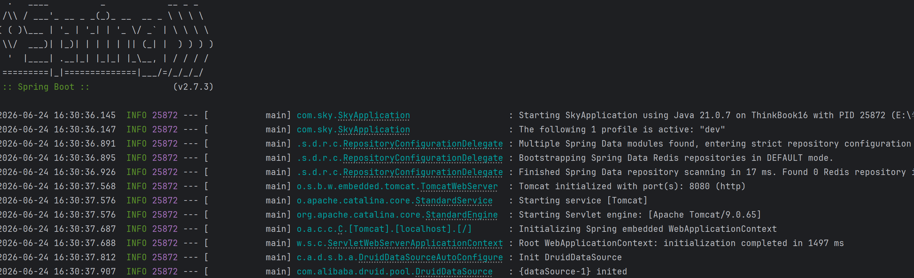
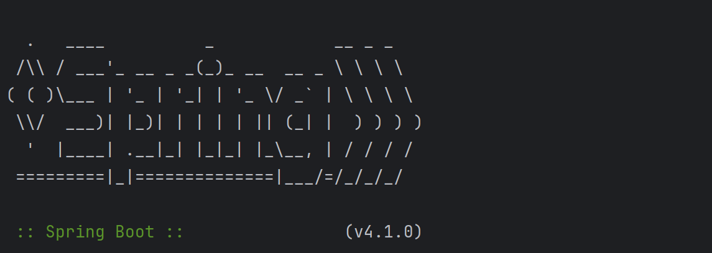
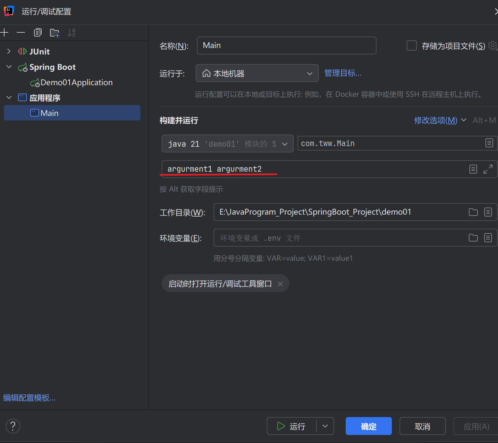
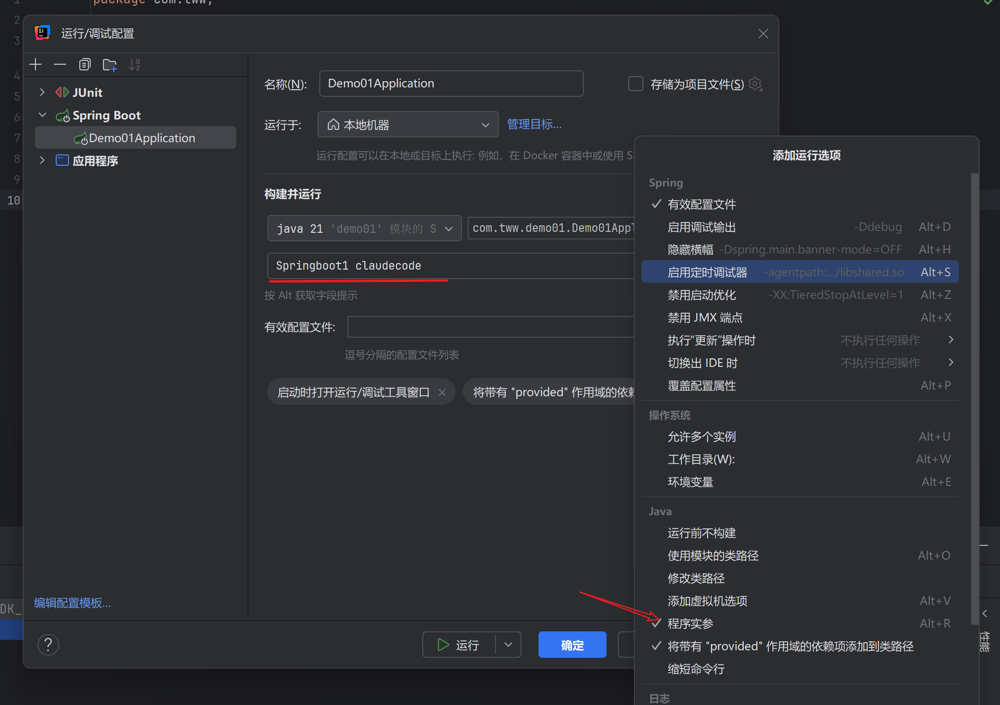

# 6.1 SpringApplication

​	通过`SpringApplication`类，可以从main方法中启动Spring应用程序，直接调用`SpringApplication.run`静态方法。如下例所示：

```java
import org.springframework.boot.SpringApplication;
import org.springframework.boot.autoconfigure.SpringBootApplication;

@SpringBootApplication
public class MyApplication {

    public static void main(String[] args) {
        SpringApplication.run(MyApplication.class, args);
    }

}


```

​	程序应用启动时，会出现日志，就像下面这样



​	默认情况下，会显示`INFO`级别的日志信息，包括一些相关的启动细节。启动信息的记录可以通过设置`application.yam`文件中的

`spring.main.log-startup-info`为false来关闭。


## 6.1.1 启动失败

​	如果你的应用程序启动失败，注册的`FailureAnalyzers`会尝试提供一个专门的错误信息提示和具体的解决办法。例如，你在端口8080上启动一个网络应用，而该端口已经被使用了，会看到类似下面的信息

```tex
***************************
APPLICATION FAILED TO START
***************************

Description:

Embedded servlet container failed to start. Port 8080 was already in use.

Action:

Identify and stop the process that is listening on port 8080 or configure this application to listen on another port.
```

​	

## 6.1.2 懒初始化（Lazy Initialization）

​	`SpringApplication`允许应用程序被懒初始化。**当启用懒初始化时，Bean在需要时被创建，而不是在应用程序启动时，因此，懒初始化可以减少应用程序的启动时间**。在一个Web应用程序中，启用懒初始化后将导致许多与Web相关的Bean在收到HTTP请求之后才会进行初始化。

​	**懒初始化的一个确定时它会延迟发现应用程序的问题，如果一个配置错误的Bean被懒初始化了，那么启动过程中不会出现故障，问题只有在Bean被初始化时才会显现出来**。还必须注意JVM有足够的内存来容纳应用程序的所有Bean，而不仅仅时那些在启动期间被初始化的Bean。由于这些原因，默认情况下不启动懒初始化，**建议在启用懒初始化之前，对JVM的堆大小进行微调**

​	懒初始化的办法有三种

1. 调用SpringApplicationBuilder的`lazyInitializtion`方法
2. SpringApplication的`setLazyInitialization`方法
3. 通过设置属性文件中的：`spring.main.lazy-initialization`属性来启用

```yaml
spring:
	main:
		lazy-initialization:true
```

​	注意。如果你想禁言某些Bena的懒初始化，同时对应用程序的其他部分使用懒初始化，可以使用`@Lazy(false)`注解将其Lazy属性显示的设置为false

​	


## 6.1.3 自定义Banner

​	Banner是日志输出时那段艺术字，如下：



​	最简单的办法是在项目中的`classpath`中添加banner.txt文本来替换。或者在yam文件中添加`spring.banner.image.location`指定路径,，如果该文件的编码不是UTF-8，可以通过`spring.banner.charset`属性设置 其字符编码

​	下面准备了一个deepseek 的banner，你可以把它放在项目中的`classpath`的根路径下：

```tex
${AnsiColor.CYAN}╔══════════════════════════════════════════════════════════╗
║  ██████╗ ███████╗███████╗██████╗ ███████╗███████╗███████╗██╗  ██╗
║  ██╔══██╗██╔════╝██╔════╝██╔══██╗██╔════╝██╔════╝██╔════╝██║ ██╔╝
║  ██║  ██║█████╗  █████╗  ██████╔╝███████╗█████╗  █████╗  █████╔╝
║  ██║  ██║██╔══╝  ██╔══╝  ██╔═══╝ ╚════██║██╔══╝  ██╔══╝  ██╔═██╗
║  ██████╔╝███████╗███████╗██║     ███████║███████╗███████╗██║  ██╗
║  ╚═════╝ ╚══════╝╚══════╝╚═╝     ╚══════╝╚══════╝╚══════╝╚═╝  ╚═╝
${AnsiColor.GREEN}║                         🚀  DeepSeek 应用启动中...${AnsiColor.DEFAULT}
${AnsiColor.CYAN}╚══════════════════════════════════════════════════════════╝${AnsiColor.DEFAULT}
```

​	在你的`banner.txt`文件中，可以使用`Environment`中的任何key，以及以下占位符

| `${application.version}`                                     | 你的应用程序的版本号，也就是 `MANIFEST.MF` 中声明的。 例如，`Implementation-Version: 1.0` 被打印为 `1.0`。 |
| ------------------------------------------------------------ | ------------------------------------------------------------ |
| `${application.formatted-version}`                           | 你的应用程序的版本号，如在`MANIFEST.MF`中声明的那样，并以格式化显示（用括号包围，以 `v` 为前缀）。 例如 `(v1.0)`。 |
| `${spring-boot.version}`                                     | 你所使用的Spring Boot版本。 例如 `3.2.0-SNAPSHOT` 。         |
| `${spring-boot.formatted-version}`                           | 你正在使用的Spring Boot版本，格式化显示（用大括号包围并以 `v` 为前缀）。 例如 `(v3.2.0-SNAPSHOT)`。 |
| `${Ansi.NAME}` (或 `${AnsiColor.NAME}`, `${AnsiBackground.NAME}`, `${AnsiStyle.NAME}`) | 其中 `NAME` 是一个ANSI转义代码的名称。 详见 [`AnsiPropertySource`](https://github.com/spring-projects/spring-boot/tree/main/spring-boot-project/spring-boot/src/main/java/org/springframework/boot/ansi/AnsiPropertySource.java) 。 |
| `${application.title}`                                       | 你的应用程序的标题，正如在 `MANIFEST.MF` 中声明的那样。 例如， `Implementation-Title: MyApp` 被打印成 `MyApp`。 |

​	也可以使用`spring.main.banner-mode`属性来决定banner打印模式，例如打印到`System.out`(`console`)上，或者发送到配置的logger（log），或者根本不打印（off）。

```yaml
spring:
  banner:
    location: banner.txt
  main:
    banner-mode: console 或者 log 或者 off
```

​	打印的banner被注册成一个单例bean，名字是：springBootBanner

​	如果你想以编程方式生成一个Banner，可以使用`SpringApplication.setBanner()`方法。实现`org.springframework.boot.Banner`接口并实现你自己的printBanner方法()。

​	下面实现了该接口，并且使用out输出的内容都将输出在控制台中。

```java
public class MyBanner implements Banner {
    @Override
    public void printBanner(
            Environment environment,
            @Nullable Class<?> sourceClass,
            PrintStream out) {
        System.out.println("MyBanner被调用了");
        out.println("=================================");
        out.println("      Welcome Spring Boot");
        out.println("=================================");
    }
}
```

​	然后在启动类中这样调用：

```java
@SpringBootApplication
public class Demo01Application {

    public static void main(String[] args) {
        System.out.println("main start");
        SpringApplication application =
                new SpringApplication(Demo01Application.class);

        System.out.println(application);

        application.setBanner(new MyBanner());

        System.out.println("banner set");

        application.run(args);
    }

}
```


​																					

## 6.1.4  自定义SpringApplication

​	`SpringApplication`是容器的启动器或者说构建器，可以使用静态方法来快速启动容器，如下所示

```java
SpringApplication.run(MyApplication.class,args);
```

​	也可以手动创建一个启动器的实例，来自指定`SpringApplication`的默认值，例如，你要关闭Banner，可以这样写：

```java
@SpringBootApplication
public class MyApplication {

    public static void main(String[] args) {
        SpringApplication application = new SpringApplication(MyApplication.class);
        application.setBannerMode(Banner.Mode.OFF);
        application.run(args);
    }

}
```

​	传递给`SpringApplication`的构造参数是`Spring Bean`的配置源，而大多数情况下，这些是对`@Configuration`类的引用，也可能是对`@Component`类的直接引用。而容器创建发生在`application.run`这个方法中，并初始化`ApplicationContext`，整个过程是黑盒的。

​	也可以通过`application.properties`文件来配置`SpringApplication`。参见“外部配置”以了解详情

​	

## 6.1.5 Builder API

​	如果需要建立一个包含层次结果的`ApplicationContext`（具有父/子关系的多个context），可以使用`SpringApplicationBuilder`。

​	它允许你链式调用多个方法，包括`parent`和`child`方法。创建一个层次结构。如下所示

```java
new SpringApplicationBuilder().source(Parent.class)
    .child(Application.class)
    .bannerMode(Banner.Mode.OFF)
    .run(agrs)
```

​	在创建多层次的 `ApplicationContext` 时，有一些限制。 例如，Web组件 **必须** 包含在子context中，并且父context和子context都使用相同的 `Environment`。

​	

## 	6.1.8 WEB 环境（Environment）

​	`SpringApplication`会试图帮你创建正确类型的`ApplicationContext`，确定为`WebApplicationType`的算法如下。

- 如果`Spring MVC`存在，就会使用`AnnotationConfigServletWebServerApplicationContext`
- 如果`Spring MVC`不存在而`Spring WebFlux`存在，则 使用`AnnotationConfigReactiveWebServerApplicationContext`
- 否则，将使用 `AnnotationConfigApplicationContext`。

​	这意味着，如果你在同一个应用程序中使用Spring MVC和新的 `WebClient`（来自于Spring WebFlux），Spring MVC将被默认使用。 你可以通过调用 `setWebApplicationType(WebApplicationType)` 来轻松覆盖。

也可以通过调用 `setApplicationContextFactory(…)` 来完全控制使用的 `ApplicationContext` 类型。

​	

## 6.1.9 访问命令行参数

​	在访问命令行参数之前，我们现学习如何使用idea进行传参，对于普通java程序来说， 流程如下：

1. 编辑配置
2. 添加应用程序
3. 在程序实参的输入框中输入参数，以空格分隔每个参数。例子如下



​	通过该配置向程序传入了两个参数`argurment1和argurment2`。

​	最后运行程序：

```java
public class Main {
    public static void main(String[] args) {
        for(String a:args){
            System.out.println(a);
        }
    }
}
//输出
argurment1
argurment2
```

​	而对于Springboot启动程序来说，idea不会自动包含该输入框，需要手动打开，如下



​	现在我们学会了如何将命令行参数传入程序。接下来学习如何访问命令行参数


​	如果需要访问传递给`SpringApplication.run(..)`的命令行参数，可以注入一个`org.springframework.boot.ApplicationArgument`bean。通过`ApplicationArguments`接口，可以访问原始的`String[]`参数，以及结果解析的`option`和`non-option`参数。所谓`option`就是命令行参数中前缀带`--`的，例如：

```tex
--debug
--server.port=8081
--name=tom
```

​	Spring会把它当成配置项，本质上是`key/value`，和`Environment`类似，是另一种配置选项，上面的例子会被解析成

- option name：debug / server.port / name

- option value：true / 8081 / tom

​	而`non-option`就是不带`--`的。它就是代表单纯的字符串，String会把它们当做一个`List<String>`处理。

​	下面通过`ApplicationArguments`接口来访问到这些参数

​	例：

```java
@Component
public class MyBean {

    public MyBean(ApplicationArguments args) {
        boolean debug = args.containsOption("debug");
        List<String> files = args.getNonOptionArgs();
        if (debug) {
            System.out.println(files);
        }
        // if run with "--debug logfile.txt" prints ["logfile.txt"]
    }

}


```

​	运行该程序，Springboot启动流程为：

```tex
SpringApplication.run()
        ↓
创建 ApplicationContext
        ↓
扫描 @Component
        ↓
实例化 MyBean
        ↓
调用构造方法 MyBean(ApplicationArguments args)
        ↓
执行你的逻辑
```

​	最后，命令行参数为：

```tex
--debug list1 tww home myword
```

​	

## 6.1.10 使用`ApplicationRunner`和`CommandLineRunner`

​	如果你需要在SpringApplication启动后运行一些特定的代码，可以实现`ApplicationRunner`或`CommandLineRunner`接口。者两个接口以相同的方式工作，并提供一个单一的run方法。该方法在`SpringApplication.run(..)`执行完毕之前被调用

​	`CommandLineRunner`接口以字符串数组形式提供了对应用程序参数（启动参数）的访问，而`ApplicationRunner`使用前面讨论的`ApplicationArguments`接口。

```java

@Component
public class MyCommandLineRunner implements CommandLineRunner {

    @Override
    public void run(String... args) {
        // Do something...
    }

}


```


该方法适合做如下工作：

- 初始化缓存
- 启动后加载数据
- 检查环境
- 打日志
- 启动任务调度
- 提前预热系统


## 6.1.11 程序退出

​	每个`SpringApplication`都向JVM注册了一个`shutdown hook`，以确保`ApplicationContext`在退出时优雅的关闭。所有标准的`Spring`生命周期回调都可以使用

​	此外，如果Bean希望在调用`SpringApplication.exit()`时返回特定的退出代码，可以实现`ExitCodeGenerator`接口，然后这个退出代码就可以被传递给`System.exit()`，作为状态代码返回。如下例所示

```java

@SpringBootApplication
public class MyApplication {

    @Bean
    public ExitCodeGenerator exitCodeGenerator() {
        return () -> 42;
    }
    //上面这个返回方式使用了lambda表达式简化，看不明白就看下面这个
    /*
    @Bean
    public ExitCodeGenerator exitCodeGenerator() {
        return new ExitCodeGenerator() {
            @Override
            public int getExitCode() {
                return 42;
            }
        };
    }
    */

    public static void main(String[] args) {
        System.exit(SpringApplication.exit(SpringApplication.run(MyApplication.class, args)));
    }

}


```


​	另外，`ExitCodeGenerator`接口可以又异常（Exception）实现，当遇到这种异常时，SpringBoot会返回由实现的`getExitCode()`方法提供的退出代码

```java
public class MyException extends RuntimeException implements ExitCodeGenerator {

    @Override
    public int getExitCode() {
        return 42;
    }
}
```

​	在发生该异常时，SpringBoot会返回42

​	如果有多个 `ExitCodeGenerator` ，则使用第一个生成的非零退出代码。 要控制生成器（Generator）的调用顺序，你可以实现 `org.springframework.core.Ordered` 接口或使用 `org.springframework.core.annotation.Order` 注解。


## 6.1.12 Spring Boot 启动到初始化完成的完整流程

1. 启动入口阶段
   	 Spring Boot 从 `main` 方法进入，执行 `SpringApplication.run()`。该阶段主要完成应用类型推断（Servlet / Reactive）、启动监听器初始化，并开始构建运行环境的基础结构。

2. Environment 构建阶段
      系统合并命令行参数（CommandLine Arguments）、系统属性、环境变量以及配置文件（application.yml / properties）。在此过程中，命令行参数会被解析为 option 与 non-option 两类，并最终形成 `ConfigurableEnvironment`，同时完成 profile 的初始化。

3. ApplicationContext 创建阶段
    Spring Boot 根据应用类型创建对应的 `ApplicationContext`（Web 应用通常为 `AnnotationConfigServletWebServerApplicationContext`）。同时初始化核心组件，如 `BeanFactory`、资源加载器（ResourceLoader）以及 BeanDefinition 注册中心。

4. BeanDefinition 加载阶段
    通过组件扫描（@ComponentScan）、配置类解析（@Configuration）、自动配置机制（AutoConfiguration）等方式，将所有 Bean 的定义信息注册到容器中。此阶段仅完成“定义注册”，不涉及对象创建。

5. refresh 核心刷新阶段
    执行 `context.refresh()`，进入 Spring 容器最核心的生命周期流程。该阶段包括 BeanFactory 准备、后置处理器执行、BeanPostProcessor 注册等关键步骤，为 Bean 的创建和增强机制建立基础。

6. BeanFactoryPostProcessor 执行阶段
    在 Bean 实例化之前执行，用于修改 BeanDefinition。例如处理 @Configuration 类、@Autowired 解析、@ConfigurationProperties 绑定等逻辑，本质是对“Bean定义”进行加工，而不是创建对象。

7. BeanPostProcessor 注册阶段
    注册 Bean 后置处理器，为后续 Bean 的生命周期提供扩展能力，包括依赖注入处理、AOP 代理生成、生命周期增强等机制。

9. Bean 实例化与依赖注入阶段
    容器开始创建 Bean 实例。首先通过构造器或工厂方法实例化对象，然后执行依赖注入（构造器注入、Setter 注入、字段注入），完成 @Autowired、@Value 等依赖绑定。

9. Bean 初始化阶段
    依次执行 Bean 的初始化回调，包括 @PostConstruct、InitializingBean.afterPropertiesSet() 以及自定义 init-method。同时通过 BeanPostProcessor 进行初始化前后增强，例如 AOP 代理的生成。

10. Web 容器启动阶段
     如果是 Web 应用，Spring Boot 会初始化内嵌 Tomcat（或其他容器），创建 ServletContext，注册 DispatcherServlet，并完成 Filter、Interceptor 等 Web 组件的加载与绑定。

11. Spring MVC 初始化阶段
     初始化 MVC 核心组件，包括 HandlerMapping、HandlerAdapter、ExceptionResolver 以及 HttpMessageConverter，使请求分发机制进入可用状态。

12. Runner 执行阶段
     容器完全初始化完成后执行 CommandLineRunner 和 ApplicationRunner。多个 Runner 可通过 @Order 或 Ordered 接口控制执行顺序。该阶段通常用于启动后初始化任务或数据预热。

13. 应用就绪阶段
     所有 Bean 初始化完成，Web 容器启动完毕，Spring Boot 输出 Started 日志，应用进入可服务状态，可以开始接收外部请求。


# 6.2 外部化配置

​	Spring Boot可以让你将配置外部化，这样就可以在不同的环境中使用相同的应用程序代码。可以通过使用各种外部配置源，包括`Java properties`文件、`YAML`文件、环境变量和命令行参数

​	属性值可以通过使用`@Value`注解直接注入到你的Bean，也可以通过Spring的`Environment`访问，或者通过`@ConfigurationProperties`绑定到对象

​	SpringBoot使用一个非常特别的`PropertySource`顺序，旨在允许合理地重写值。**后面的`property source`可以覆盖签名属性源中定义的值**，按以下顺序考虑

1. 默认属性（通过`SpringApplication.setDefaultProperties`方法指定），示例：

   ```java
       SpringApplication app = new SpringApplication(App.class);
   	Map<String, Object> defaults = new HashMap<>();
       defaults.put("server.port", "8088");
       defaults.put("my.name", "default-name");
   
       app.setDefaultProperties(defaults);
   ```

2. `Configuration`类上的`@PropertySource`注解。请注意，这样的属性源知道`application context`被刷新时才会被添加到环境中。这对配置某些属性来说太晚了，比如`loggin.*`和`spring.main.*`，它们在刷新开始前就已经被读取了

3. 配置数据（如`application.properties、application.yam`文件等）

4. `RandomValuePropertySource`，它用于生成随机属性，是SpringBoot内置的“随机值配置源”。

5. 操作系统环境变量

6. Java System properties(`System.getProperties`)

7. `java:comp/env`中的JNDI属性

8. 命令行参数


​	建议你在整个应用程序中坚持使用一种格式，如果你同时有`.properties`和`YAML`格式的配置文件，那么`.properties`优先生效，而官方建议你统一使用`YAML`格式的配置文件。

​	如果你使用环境变量而不是系统属性，大多数系统操作不允许使用句点分隔的键名，但你可以使用下划线代替（例如,`SPRING_CONFIG_NAME`代替`spring.config.name`）。

​	

​	下面提供一个具体的例子，假设你开发了一个`@Component`，使用了一个`name`属性，如下面例子所示

```java
import org.springframework.beans.factory.annotation.Value;
import org.springframework.stereotype.Component;

@Component
public class MyBean {

    @Value("${name}")
    private String name;

    // ...

}
```

​	在你的应用程序的`classpath`（例如，在你的jar中），可以有一个`application.properties`文件，为name提供一个合理的默认属性值，当在一个新的环境中允许时，可以在你的jar之外提供一个`application.properties`文件来覆盖name。对于一次性的测试，可以用一个特定的命令行参数来启动（例如，`java -jar app.jar --name="Spring"`）

​	

## 6.2.1 访问命令行属性

​	默认情况下，`SpringApplication`会将任何命令行选项参数（即以`--`开头的参数，如`--server.port=9000`）转化为`property`并将其添加到Spring `Environment`中，如前所述，命令行属性总是优先于基于文件的属性源。

​	如果你不希望命令属性被添加到`Environment`中，可以通过`SpringApplication.setAddCommandLineProperties(false)`禁用它们

```java
    public static void main(String[] args) {
        SpringApplication application =
                new SpringApplication(App.class);
        application.setAddCommandLineProperties(false);
        application.run(args);
    }
```

​	

## 6.2.2 JSON Application Properties	

​	环境变量和系统属性往往有限制，这意味着有些属性名称不能使用，为了解决这个问题，SpringBoot允许你将一个属性块编码为一个单一的JSON结构。

​	当你的应用程序启动时，任何`spring.application.json`或`SPRING_APPLICATION_JSON`属性将被解析并添加到`Environment`中

​	例如，`SPRING_APPLICATION_JSON`属性可以在UNIXshell命令行中作为环境变量提供

```shell
$ SPRING_APPLICATION_JSON='{"my":{"name":"test"}}' java -jar myapp.jar
```

​	在上面的例子中，你在Spring的`Environment`中最终得到了`my.name=test`。

​	同样的JSON也可以作为一个系统属性提供。

```shell
$ java -Dspring.application.json='{"my":{"name":"test"}}' -jar myapp.jar
```

​	或者可以通过使用一个命令行参数来提供JSON

```shell
$ java -jar myapp.jar --spring.application.json='{"my":{"name":"test"}}'
```

​	


## 6.2.3 外部的Application Properties

​	当你的应用程序启动时，**Spring Boot会自动从以下为准找到并加载`application.properties`和`application.yaml`文件**

1. classpath

   1. classpath根路径
   2. classpath下的`/config`包
2. 当前目录

   1. 当前目录下
   2. 当前目录下的`/config`子目录
   3. `config/`子目录的直接子目录

​	列表按优先级排序（较低项目的值覆盖较早项目的值，意思是`classpath`根路径先被添加，后被添加的当前目录下`config`子目录会覆盖掉前面的值）。


## 6.2.5 使用YAML

​	YAML是JSON的超集，因此是指定分层配置数据的方便格式。只要你的`classpath`上有`SnakeYAML`库。`SpringApplication`类就会自动支持YAML作为`properties`的替代品

​	


